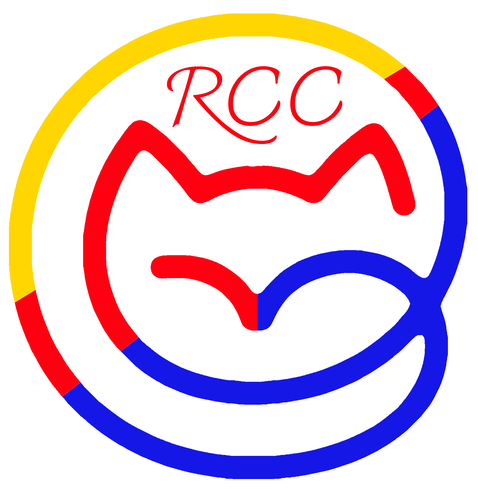

  
  
  <h1>🐱 Red Cat Cuasar</h1>
  
  
<strong>Modern cat platform built with Next.js and Firebase</strong>

  
  

    
    
    
  

  

  
  <table align="center">
    <tr>
      <td align="center">
        
      </td>
      <td align="center">
        
      </td>
      <td align="center">
        
      </td>
    </tr>
    <tr>
      <td align="center">
        
      </td>
      <td align="center">
        
      </td>
      <td align="center">
        
      </td>
    </tr>
    <tr>
      <td align="center">
        
      </td>
      <td align="center">
        
      </td>
      <td align="center">
        
      </td>
    </tr>
  </table>

  

<h2>✨ FEATURES</h2>

<table align="center" width="90%">
  <tr>
    <td align="center" width="50%">
      <h3>🔍 Advanced Search & Filtering</h3>
      
<em>Search and filter cats by various criteria</em>

    </td>
    <td align="center" width="50%">
      <h3>📱 Responsive Design</h3>
      
<em>Works on desktop, tablet, and mobile devices</em>

    </td>
  </tr>
  <tr>
    <td align="center">
      <h3>🌍 Multi-language Support</h3>
      
<em>DeepL API integration for translations</em>

    </td>
    <td align="center">
      <h3>🔐 Admin Dashboard</h3>
      
<em>Management interface for platform administration</em>

    </td>
  </tr>
  <tr>
    <td align="center">
      <h3>🎨 3D Interactive Elements</h3>
      
<em>React Three Fiber for 3D graphics</em>

    </td>
    <td align="center">
      <h3>⚡ Performance Optimized</h3>
      
<em>Fast loading with caching and optimization</em>

    </td>
  </tr>
</table>

  

<h2>🛠️ TECH STACK</h2>

<table align="center" width="90%">
  <tr>
    <td align="center" width="33%">
      <h3>🎨 Frontend</h3>
      
<strong>Next.js 15</strong> with App Router

      
<strong>TypeScript</strong> for type safety

      
<strong>Tailwind CSS</strong> for styling

      
<strong>Radix UI</strong> components

      
<strong>Framer Motion</strong> animations

    </td>
    <td align="center" width="33%">
      <h3>⚡ Backend</h3>
      
<strong>Firebase</strong> Firestore database

      
<strong>Firebase Auth</strong> authentication

      
<strong>Redis</strong> caching via Upstash

      
<strong>DeepL API</strong> translations

      
<strong>Vercel</strong> analytics

    </td>
    <td align="center" width="33%">
      <h3>🛠️ Development</h3>
      
<strong>Bun</strong> runtime

      
<strong>Cypress</strong> E2E testing

      
<strong>ESLint</strong> code linting

      
<strong>Prettier</strong> code formatting

      
<strong>TypeScript</strong> strict mode

    </td>
  </tr>
</table>

  

<h2>🏗️ ARCHITECTURE</h2>

<table align="center" width="80%">
  <tr>
    <td align="center">
      
    </td>
  </tr>
  <tr>
    <td align="center">
      
      
      
    </td>
  </tr>
  <tr>
    <td align="center">
      
      
    </td>
  </tr>
  <tr>
    <td align="center">
      
      
    </td>
  </tr>
</table>

  

<h2>🌐 DEPLOYMENT</h2>

<table align="center" width="90%">
  <tr>
    <td align="center" width="33%">
      <h3>🚀 Platform Ready</h3>
      
<em>Configured for modern hosting platforms</em>

    </td>
    <td align="center" width="33%">
      <h3>🛡️ Production Build</h3>
      
<em>Includes security and optimization features</em>

    </td>
    <td align="center" width="33%">
      <h3>⚡ Optimized</h3>
      
<em>Built for Vercel and Firebase Hosting</em>

    </td>
  </tr>
</table>

  

  <h3>🐱 <strong>Built with ❤️ for feline enthusiasts worldwide</strong> 🐱</h3>
  
   
  
  
  

